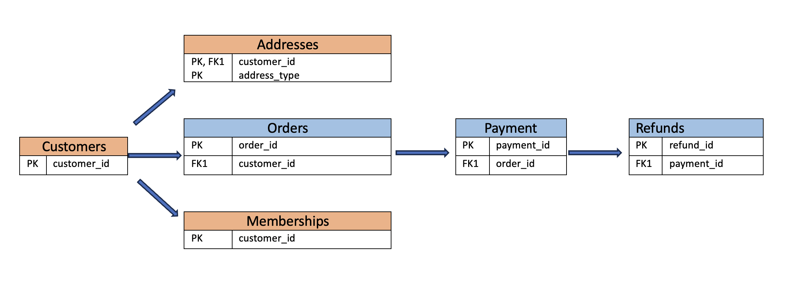
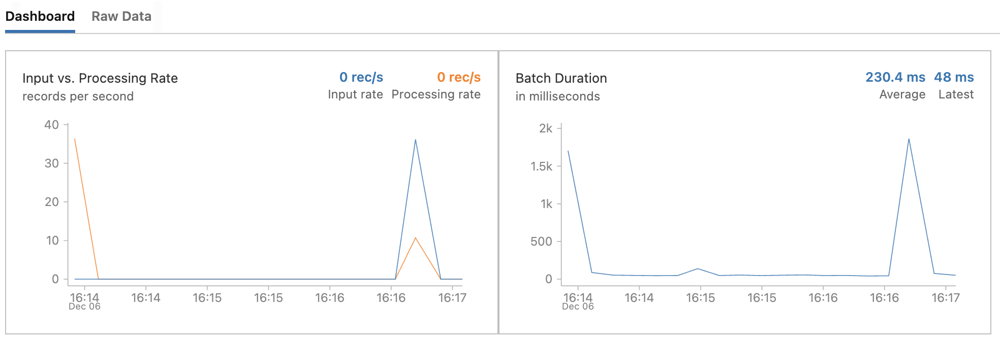
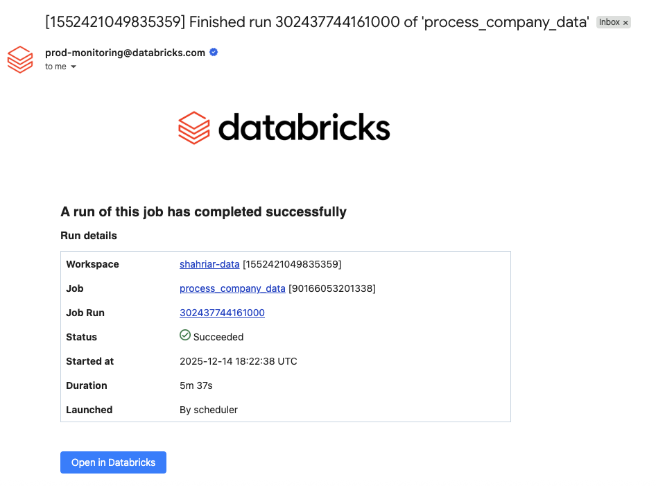

# 📘 ETL Lakehouse Workflow & Streaming Ingestion Projects

This repository contains four comprehensive Databricks projects designed to demonstrate modern data engineering patterns on AWS. 

- etl-lakehouse-workflow project showcases a full Lakehouse architecture built using Terraform, implementing the Medallion (Bronze–Silver–Gold) design, Unity Catalog governance, and automated ingestion pipelines from multiple data sources. 

- etl-with-apache-spark-streaming project focuses specifically on streaming data ingestion, comparing traditional Spark Structured Streaming with Databricks Auto Loader. It demonstrates scalable, schema-aware ingestion of cloud file streams into Delta Lake.

- etl-lakehouse-declarative-pipeline-dlt project demonstrates an end-to-end lakeFlow declarative pipeline. It ingests data from S3 and applies Medallion Architechture. It also uses expect keyword for streaming validation along with the required course of action.

- etl-databricks-jobs ingests data from s3 and by implementing medallion architechture, it creates bronze-silver-gold layers. These layers are assigned as tasks in the job. It also demonstrates how to schedule the job and send notification after success or failure.

# 📘 ETL Lakehouse Workflow Project  
## Medallion Architecture + Terraform Infrastructure

This project demonstrates an end-to-end **AWS Databricks Lakehouse** implementation, including:

- Automated infrastructure provisioning using **Terraform**
- Ingesting data from **multiple sources & formats**
- Applying the **Medallion Architecture** (Bronze → Silver → Gold)
- Building analytics-ready **Gold Layer** tables for BI & ML
- Integration with **S3, IAM, Secrets Manager, JDBC**
- Using **Unity Catalog** for secure governance

All AWS resources required for Databricks + S3 access are provisioned using Terraform following IAM and security best practices.

---

# 🏗 ETL Architecture Overview

This project implements the **Medallion Architecture**:

```pgsql

Landing (S3 Raw Data)
↓
Bronze (Ingested Raw Tables)
↓
Silver (Cleaned / Conformed)
↓
Gold (BI + ML Ready Models)
```

---

# Data Structure

<p align="center">
  
</p>

---


# 📦 Data Sources

- **Customers** → JSON files  
- **Addresses** → CSV files  
- **Memberships** → Image files (`binaryFile` format)  
- **Orders** → CSV  
- **Payments** → Monthly CSV extracts  
- **Refunds** → PostgreSQL table via JDBC  

---

# 🟨 Final Gold Outputs

### **customer_address**
Single record per customer with flattened address information.

### **order_monthly_summary**
Monthly customer order aggregated metrics:
- total orders  
- total items  
- total amount spent  

---

# 📘 ETL With Apache Spark Streaming Project

This project ingests raw customer data from S3 into Delta Lake using Spark streaming, starting with standard Structured Streaming concepts and enhancing them using Databricks Auto Loader for scalability, performance, and schema management.

---

📥 End-to-End Streaming Workflow in This Project

1. Read files from S3 using Auto Loader (cloudFiles).

2. Add metadata columns, including:

   - file_path – source file location

   - ingest_date – timestamp when ingested

3. Write the transformed stream to a Bronze Delta table with checkpointing.

---

Streaming Dashboard:


<p align="center">
  
</p>

---

# 📦 Data Sources

- **Customers_autoloader** → JSON files 
- **Customers_stream** → JSON files

---


Flow:
```pgsql
S3 → Auto Loader → Bronze Delta Table → Silver Transformation → Gold Analytics Tables
```

---

# 🟫 Stores Streaming Data in Bronze Layer for Later use

### **customer_steam**
    - Stores data as defined in the static schema

### **customers_autoloader**
    - Stores data dynamically by using automatic schema inference from sample files.

---

# 📘 Lakeflow Declarative Pipeline Project 
## Medallion Architecture + Terraform Infrastructure

This project demonstrates an end-to-end **LakeFlow declarative Pipeline** implementation, including:

- Automated infrastructure provisioning using **Terraform**
- Ingesting data from **multiple sources & formats**
- Applying the **Medallion Architecture** (Bronze → Silver → Gold)
- Using the **EXPECT** keyword for streaming data validation, along with the required actions, in both Spark SQL and PySpark.
- Building analytics-ready **Gold Layer** tables for BI & ML
- Using **Unity Catalog** for secure governance

All AWS resources required for Databricks + S3 access are provisioned using Terraform following IAM and security best practices.

---

# Data Structure

<p align="center">
  
</p>

---

## ETL Workflows

### 1. Customers Data Pipeline
Steps:
1. Ingest raw customer data → `bronze_customers`
2. Apply data quality expectations  
3. Store cleaned output → `silver_customers_clean`
4. Apply SCD Type 1 logic  
5. Store final curated table → `silver_customers`

---

### 2. Addresses Data Pipeline
Steps:
1. Ingest raw address data → `bronze_addresses`
2. Apply data quality expectations  
3. Store cleaned output → `silver_addresses_clean`
4. Apply SCD Type 2 logic  
5. Store final curated table → `silver_addresses`

---

### 3. Orders Data Pipeline
Steps:
1. Ingest raw order data → `bronze_orders`
2. Apply expectations and validation  
3. Store cleaned output → `silver_orders_clean`
4. Apply SCD Type 1 logic  
5. Store final curated table → `silver_orders`

---

## Gold Layer (Final Aggregated Model)

The Silver tables are joined to produce a final Gold dataset:

- `silver_customers`  
- `silver_addresses` (latest address per customer)  
- `silver_orders`  

### Final Metrics:
- `total_orders`  
- `total_items_order`  
- `total_order_amount`  

This table supports BI dashboards, ML feature engineering, and downstream analytics.

---


# 📘 Databricks Jobs Project
## Medallion Architecture + Terraform Infrastructure

## Overview
This project implements a **Databricks multi-layer data job** following the **Bronze → Silver → Gold** architecture.  
The pipeline ingests company data from a landing folder, performs transformations, and produces aggregated insights.

---

## Architecture
The pipeline is organized into three layers:

- **Bronze Layer**: Raw data ingestion
- **Silver Layer**: Cleansed and transformed data
- **Gold Layer**: Aggregated and business-ready data

---

## Job Structure

### 1. 🟫 Bronze Layer – Ingest Companies Data
**Task Name:** `process_company_data`

#### Responsibilities
- Create the `bronze` schema if it does not already exist
- Read raw companies data from the landing folder
- Create the `bronze.companies` table
- Store raw data with minimal transformation

#### Output
- **Table:** `bronze.companies`

---

### 2. Silver Layer – Transform Companies Data
**Task Name:** `silver.companies`

#### Responsibilities
- Create the `silver` schema if it does not already exist
- Read data from `bronze.companies`
- Apply data transformations and cleansing
- Generate derived columns:
  - `company_id`
  - `founded_year`
- Create the `silver.companies` table

#### Output
- **Table:** `silver.companies`

---

### 3. 🟨 Gold Layer – Company Summary
**Task Name:** `03_gold_company_summary`

#### Responsibilities
- Create the `gold` schema if it does not already exist
- Aggregate company data from the silver layer
- Calculate the number of companies per country
- Create a business-ready summary table

#### Output
- **Table:** `gold.company_summary`
- **Metric:** Number of companies per country

---

## Data Flow
```text
Landing Folder
      ↓
Bronze Layer (Raw Data)
      ↓
Silver Layer (Transformed Data)
      ↓
Gold Layer (Aggregated Insights)
```

---
## Email notification after job success/failure

<p align="center">
  
</p>

---

## AWS Infrastructure

This setup provisions:

1. **AWS S3 Bucket**
   - Bucket: `amzn-s3-gizmobox-project-bucket`
   - Region: `us-west-2`
   - Tagged for environment (`Dev`) and name.

2. **AWS Secrets Manager**
   - Secret: `db_secrets`
   - Stores Databricks credentials (`databricks_host` and `databricks_token`) securely.

3. **IAM Role for Databricks**
   - Role: `DatabricksS3AccessRole`
   - Policies attached:
     - `AccessDBSecrets` → allows retrieving Databricks secrets from Secrets Manager.
     - `DatabricksS3Access` → allows full access to S3 bucket objects.
   - Trust policy:
     - Self-assuming (required for Unity Catalog).
     - Databricks AWS account can assume the role.

4. **Databricks Storage Credential**
   - Connects Databricks Unity Catalog to the S3 bucket using the IAM role.

5. **Copy files in S3 Bucket**
    - AWS CLI aws s3 sync command has been used to copy files in S3 bucket in specified folder structure.


---
# Databricks S3 & Secrets Terraform Setup

All the AWS resources needed for Databricks unity catalog to securly connect to AWS S3 Bucket to access and store data are provisioned using Terraform. It follows best practices for IAM, Secrets Manager, and storage credentials.

---

## Copying Files to S3

To upload or sync files to the provisioned S3 bucket, the AWS CLI can be used.

### ⚠️ About Authentication Used in This Project

While **best practice** is to use **AWS IAM roles** with permissions to write to the S3 bucket (avoiding long-lived credentials entirely), **for convenience in this setup we used local AWS credentials**.

Specifically:

- The `aws_access_key_id` and `aws_secret_access_key` from your **local AWS credentials file** (usually stored in `~/.aws/credentials`) were used to authenticate the AWS CLI when copying data into the S3 bucket.

This allows simple CLI-based copying but should be avoided in production environments.

## Examples

```bash
aws s3 sync ./data/Customers s3://${var.s3_bucket_name}/gizmobox/landing/operational-data/Customers
```


### Example


# 🧪 How to Run

1. Deploy Infrastructure
from root folder:
    - terraform init
    - terraform plan
    - terraform apply

2. Upload Raw Data to S3

bash Copy code
```bash
aws s3 sync ./data/Customers s3://${var.s3_bucket_name}/gizmobox/landing/operational-data/Customers
```

3. Generate a Databricks Personal Access Token Databricks UI → User Settings → Developer → Access Tokens → Generate Token

4. Run Databricks Notebooks in Order

# 🔧 Prerequisites
Generate a Databricks Personal Access Token

Databricks UI → User Settings → Developer → Access Tokens → Generate Token

Create AWS Secrets Manager Entry

Secret name: db_secrets

Keys required:

    - databricks_host

    - databricks_token